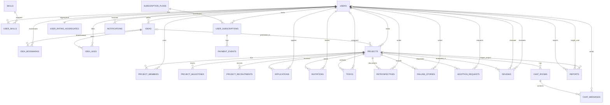

# Devory PostgreSQL ERD

아래 ERD는 01_postgresql_schema.sql 기준의 핵심 관계를 요약한 다이어그램이다.

## 관계 해설 요약
- users는 아이디어/프로젝트/지원/리뷰/알림의 중심 엔티티다.
- projects는 협업 실행 단위이며 members, applications, todos, reviews를 가진다.
- subscriptions는 plans -> user_subscriptions -> payment_events로 결제 이력을 추적한다.
- reports는 유저 또는 프로젝트를 신고 대상으로 가질 수 있다.
