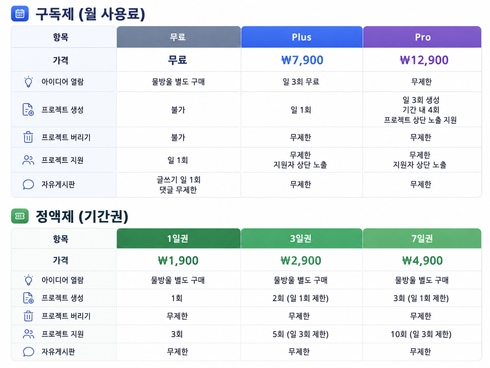
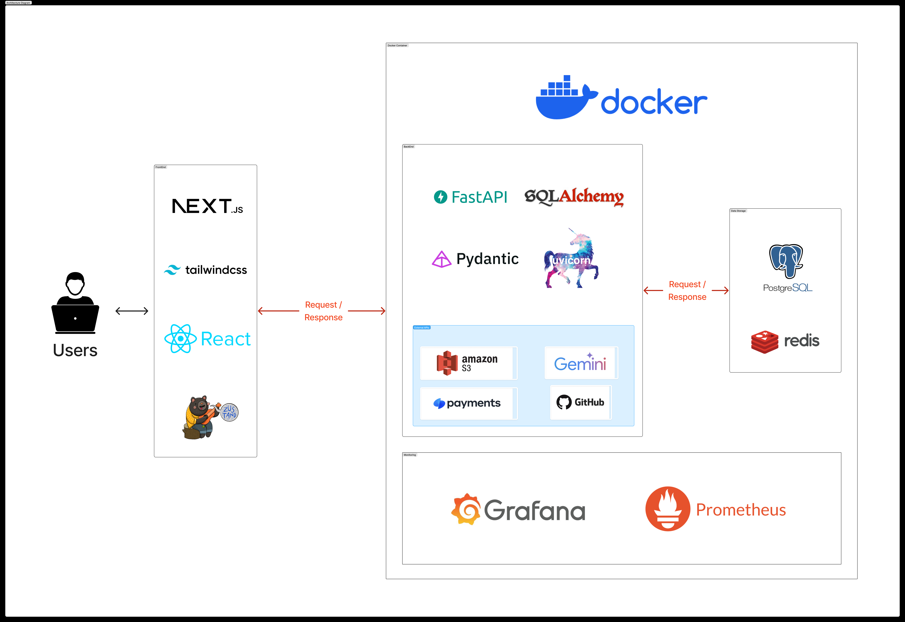

# 🚀 Devory

> **Idea Is Power!**  
> Devory는 아이디어를 가진 사람들이 팀을 찾고, 프로젝트를 시작하고, 중단된 아이디어까지 다시 이어갈 수 있도록 돕는 프로젝트 협업 플랫폼입니다.

<div style="display:flex; justify-content:space-between; align-items:center;">
	
	
</div>

## 🌐 서비스 주소

- 서비스: https://devory.kr
- API 문서: https://api.devory.kr/docs

---

## 1. Devory란?

Devory는 개발자뿐 아니라 디자이너, 기획자, 학생, 창업자처럼 아이디어를 가진 누구나 프로젝트를 시작할 수 있도록 돕는 웹 서비스입니다.

최근 바이브 코딩, 노코드/로우코드, AI 기반 개발 도구의 확산으로 서비스를 만드는 진입장벽은 낮아졌습니다. 하지만 여전히 많은 사람들은 다음과 같은 어려움을 겪습니다.

- 좋은 아이디어가 있어도 함께할 팀원을 찾기 어렵다.
- 초보자는 무엇을 만들지, 누구와 시작할지 몰라 실행으로 이어지지 못한다.
- 숙련자도 더 나은 아이디어나 팀을 찾기 어렵다.
- GitHub에는 중단된 프로젝트와 미완성 코드가 많이 남아 있지만, 이를 다시 활용하는 구조가 부족하다.
- 기존 커뮤니티는 논의에 그치는 경우가 많아 실제 프로젝트로 이어지기 어렵다.

Devory는 이러한 문제를 해결하기 위해 **아이디어 → 팀 구성 → 프로젝트 수행 → 회고와 경험 축적 → 아이디어 재활용**으로 이어지는 순환형 협업 구조를 제공합니다.

---

## 2. 핵심 컨셉

Devory는 세 가지 공간을 중심으로 구성됩니다.

### 🌱 개발의 땅

실제로 진행 중인 프로젝트들이 자라는 공간입니다.  
사용자는 새로운 아이디어를 등록해 프로젝트를 만들고, 다른 사용자는 관심 있는 프로젝트에 지원할 수 있습니다.

### 🌿 생각의 뜰

중단되었거나 더 이상 진행하기 어려운 프로젝트가 아이디어 형태로 보존되는 공간입니다.  
다른 사용자는 이 아이디어를 다시 주워 자신의 프로젝트로 이어갈 수 있습니다.

### 🔥 모닥불

사용자들이 프로젝트 아이디어, 개발 경험, 질문, 회고, 자료 등을 자유롭게 공유하는 커뮤니티 공간입니다.

Devory의 핵심 흐름은 다음과 같습니다.

```text
아이디어 등록
→ 개발의 땅에서 프로젝트로 시작
→ 팀원 모집 및 협업
→ Todo와 채팅으로 프로젝트 진행
→ 완료 후 회고 작성
→ 중단된 프로젝트는 생각의 뜰로 이동
→ 다른 사용자가 아이디어를 주워 다시 프로젝트화
```

---

## 3. 대상 사용자

Devory는 다음과 같은 사용자를 위해 만들어졌습니다.

* 만들고 싶은 아이디어는 있지만 함께할 팀원을 찾기 어려운 사람
* 프로젝트 경험을 쌓고 싶은 초보 개발자
* 기획, 디자인, 개발 역량을 가진 팀원을 찾고 싶은 사람
* 중단된 프로젝트를 그냥 버리지 않고 다시 이어가고 싶은 사람
* 다른 사람의 아이디어를 기반으로 새 프로젝트를 시작하고 싶은 사람
* 프로젝트 경험을 회고와 포트폴리오로 정리하고 싶은 사람

Devory는 개발자만을 위한 서비스가 아니라, **아이디어를 가진 누구나 팀을 만들고 프로젝트를 시작할 수 있는 협업 공간**을 지향합니다.

---

## 4. 주요 기능

## 4.1 로그인 및 인증

Devory는 사용자 인증을 기반으로 개인화된 프로젝트 경험을 제공합니다.

주요 기능은 다음과 같습니다.

* 이메일/비밀번호 로그인
* GitHub OAuth 로그인
* Google OAuth 로그인
* 로그아웃
* 회원 탈퇴
* 아이디 및 비밀번호 찾기
* 토큰 만료 시 재로그인 안내
* OAuth 계정 연동 관리

GitHub 계정의 이메일이 공개되지 않은 경우에도 안정적으로 가입 및 로그인이 가능하도록 fallback 이메일 처리 구조를 적용했습니다.

---

## 4.2 개발의 땅: 프로젝트 등록과 팀원 모집

사용자가 새로운 아이디어를 등록하면 해당 아이디어는 단순 게시글이 아니라 바로 프로젝트로 생성됩니다.
생성된 프로젝트는 **개발의 땅**에 표시되며, 다른 사용자는 프로젝트 정보를 확인하고 지원할 수 있습니다.

주요 기능은 다음과 같습니다.

* 프로젝트 생성
* 제목, 설명, 기술 스택, 해시태그, 난이도, 모집 규모 설정
* 프로젝트 목록 및 상세 조회
* 프로젝트 지원
* 지원자 목록 확인
* 지원자 프로필 조회
* 팀 결성
* 프로젝트 상단 노출

Devory에서 아이디어 등록은 곧 프로젝트 시작을 의미합니다.

---

## 4.3 팀 매칭과 협업 시작

프로젝트에 관심 있는 사용자는 지원 기능을 통해 참여 의사를 보낼 수 있습니다.
프로젝트 생성자는 지원자의 프로필과 정보를 확인한 뒤 팀원으로 확정할 수 있습니다.

팀 결성이 완료되면 프로젝트 채팅방이 자동으로 생성되어 별도의 외부 메신저 없이 바로 협업을 시작할 수 있습니다.

주요 기능은 다음과 같습니다.

* 프로젝트 지원
* 지원자 목록 조회
* 사용자 프로필 확인
* 팀원 확정
* 팀 결성 완료 처리
* 팀 채팅방 자동 생성
* 실시간 팀 채팅

---

## 4.4 Todo 기반 프로젝트 진행 관리

프로젝트가 시작된 이후에는 Todo를 통해 작업을 관리할 수 있습니다.
Todo는 단순 체크리스트가 아니라 프로젝트 진행률, 기여도, 회고의 기반이 되는 작업 기록으로 활용됩니다.

주요 기능은 다음과 같습니다.

* 프로젝트별 Todo 생성
* Todo 완료 처리
* Todo 순서 변경
* 진행률 관리
* 팀원별 작업 흐름 확인
* WebSocket 기반 실시간 Todo 갱신
* LLM 기반 Todo 생성 보조

프로젝트 초기에 어떤 작업부터 해야 할지 막막한 경우, LLM 보조 기능을 통해 프로젝트 주제와 채팅 내용을 기반으로 Todo 후보를 생성할 수 있습니다.

---

## 4.5 생각의 뜰: 아이디어 줍기

Devory의 핵심 차별점은 프로젝트가 중단되더라도 완전히 사라지지 않는다는 점입니다.

진행 중이던 프로젝트를 더 이상 이어가기 어렵거나, 기획자는 포기했지만 아이디어 자체의 가치는 남아 있다고 판단되는 경우 해당 프로젝트를 **생각의 뜰**로 보낼 수 있습니다.

생각의 뜰에 있는 아이디어는 다른 사용자가 다시 주워갈 수 있습니다.
사용자가 마음에 드는 아이디어를 선택해 **내 프로젝트로 만들기**를 실행하면 해당 아이디어는 다시 프로젝트로 전환되어 개발의 땅으로 돌아옵니다.

주요 기능은 다음과 같습니다.

* 프로젝트 버리기
* 버려진 프로젝트를 아이디어 형태로 보존
* 아이디어 목록 조회
* 카테고리, 검색어, 좋아요, 북마크 기반 탐색
* 아이디어 상세 열람
* 좋아요 및 북마크
* 내 프로젝트로 만들기
* 아이디어가 다시 프로젝트화되면 기존 생성자에게 물방울 반환

이를 통해 Devory는 중단된 프로젝트와 아이디어가 사라지지 않고 다시 활용될 수 있는 구조를 제공합니다.

---

## 4.6 모닥불: 자유 커뮤니티

**모닥불**은 사용자들이 프로젝트 아이디어, 개발 경험, 질문, 회고, 자료 등을 자유롭게 공유하는 공간입니다.

주요 기능은 다음과 같습니다.

* 게시글 작성, 수정, 삭제
* 댓글 및 대댓글
* 추천/비추천 반응
* 게시글 및 댓글 신고
* 첨부파일 업로드
* 이미지, 동영상, PDF, 일반 파일 지원
* 인기글 알림

모닥불은 특정 요금제 사용자만을 위한 기능이 아니라, Devory 사용자들이 부담 없이 의견을 나누고 프로젝트 관련 경험을 공유하는 열린 커뮤니티 역할을 합니다.

---

## 4.7 마이페이지와 성장 기록

마이페이지는 사용자의 활동과 성장 과정을 확인하는 공간입니다.

사용자는 자신의 프로필, 아바타, 프로젝트 참여 내역, 지원 내역, 리뷰, 현재 이용권 정보를 확인할 수 있습니다.

주요 기능은 다음과 같습니다.

* 프로필 조회 및 수정
* 아바타 업로드
* 프로젝트 참여 이력 확인
* 지원 내역 확인
* 리뷰 및 평판 확인
* 현재 플랜 및 남은 기간 확인
* 회고 기록 확인

프로젝트가 완료되면 사용자는 회고를 작성할 수 있습니다.
회고는 Todo 기여도, 프로젝트 정보, 사용자의 기록과 연결되어 단순 활동 로그가 아니라 성장 포트폴리오처럼 활용될 수 있습니다.

---

## 4.8 결제, 물방울, 이용권

Devory는 Toss Payments를 활용하여 결제 기능을 제공합니다.
서비스 이용 방식에 따라 무료 플랜, 월 이용권, 기간권, 물방울 기반 기능을 제공합니다.

<div align="center">



</div>

지원하는 이용 구조는 다음과 같습니다.

| 구분           | 설명           |
| ------------ | ------------ |
| FREE         | 기본 무료 이용     |
| PLUS_MONTHLY | Plus 30일 이용권 |
| PRO_MONTHLY  | Pro 30일 이용권  |
| PASS_1D      | 1일 기간권       |
| PASS_3D      | 3일 기간권       |
| PASS_7D      | 7일 기간권       |

각 상품은 다음 기능의 사용 범위와 연결됩니다.

* 프로젝트 생성
* 프로젝트 지원
* 아이디어 열람
* 프로젝트 버리기
* 자유게시판 작성
* 프로젝트 상단 노출
* 지원자 상단 노출

현재 Plus와 Pro는 Toss 일반 결제 방식을 고려하여 자동 갱신 구독이 아니라 30일 이용권 형태로 제공됩니다.
자동 갱신 구독은 Toss Billing Key 기반 구조가 필요하므로 향후 확장 과제로 분리했습니다.

또한 카드 결제 외에도 수동 구매 요청 기능을 제공하여, 결제 오류나 예외 상황에도 관리자가 직접 승인 또는 거절할 수 있도록 했습니다.

---

## 4.9 관리자 기능

Devory는 실제 서비스 운영을 위해 관리자 기능을 제공합니다.

관리자는 사용자 관리, 신고 처리, 수동 구매 요청 처리, 게시글 및 프로젝트 관리 등을 수행할 수 있습니다.

주요 기능은 다음과 같습니다.

* 관리자 대시보드
* 사용자 검색 및 관리
* 사용자 정지 및 해제
* 신고 처리
* 게시글 강제 내리기
* 프로젝트 강제 내리기
* 코인 지급 및 환수
* 수동 구매 요청 승인/거절
* 공지 및 이벤트 관리
* 관리자 알림 발송

이를 통해 Devory는 사용자 생성 콘텐츠가 많은 서비스에서 필요한 운영 안정성을 확보합니다.

---

## 5. 사용자 이용 흐름

Devory의 기본 이용 흐름은 다음과 같습니다.

```text
1. 회원가입 또는 GitHub/Google 로그인
2. 기본 물방울 지급
3. 개발의 땅에서 프로젝트 탐색
4. 직접 프로젝트 등록
5. 관심 있는 프로젝트에 지원
6. 팀장이 지원자 확인 후 팀 결성
7. 채팅방 자동 생성
8. Todo와 채팅으로 프로젝트 진행
9. 프로젝트 완료 후 회고 작성
10. 중단된 프로젝트는 생각의 뜰로 이동
11. 다른 사용자가 아이디어를 주워 새 프로젝트로 전환
```

---

## 6. 기술 스택

| 영역              | 기술                                    |
| --------------- | ------------------------------------- |
| Frontend        | Next.js, React, JavaScript/TypeScript |
| Backend         | FastAPI, SQLAlchemy, Pydantic         |
| Database        | PostgreSQL                            |
| Cache / Session | Redis                                 |
| Storage         | AWS S3, Presigned URL                 |
| Payment         | Toss Payments                         |
| Auth            | JWT, GitHub OAuth, Google OAuth       |
| Realtime        | WebSocket                             |
| Monitoring      | Prometheus, Grafana                   |
| Infra           | Docker, Docker Compose                |
| CI/CD           | GitHub Actions                        |

---

## 7. 기술적 특징

### 서버 중심의 권한 판단

Devory는 결제, 권한, 사용량 제한처럼 중요한 판단을 프론트엔드가 아니라 백엔드에서 처리하도록 설계했습니다.
사용자가 결제를 요청하면 프론트엔드는 상품 코드만 전달하고, 실제 금액과 주문명은 서버가 DB의 상품 정보를 기준으로 확정합니다.

이를 통해 금액 변조, 권한 우회, 데이터 불일치를 줄이고 실제 서비스 운영에 가까운 구조를 구현했습니다.

### Private S3와 Presigned URL

파일은 AWS S3에 저장하되, DB에는 실제 URL이 아니라 S3 key만 저장합니다.
조회 시점에 백엔드가 presigned URL을 생성하여 사용자에게 전달합니다.

이를 통해 S3 버킷을 공개하지 않고도 파일을 안전하게 열람할 수 있습니다.
또한 한글 파일명으로 인한 URL 인코딩 및 서명 문제를 방지하기 위해 UUID 기반 ASCII key를 사용합니다.

### WebSocket 기반 실시간 협업

프로젝트 채팅과 Todo 변경은 WebSocket을 통해 실시간으로 반영됩니다.
운영 환경에서는 `wss://api.devory.kr` 기반으로 연결하며, Nginx reverse proxy에서 WebSocket upgrade 헤더를 전달하도록 구성했습니다.

### 인증과 Redis

Devory는 JWT 기반 인증을 사용하며, Redis를 인증 보조 저장소로 활용합니다.

Redis는 다음 역할을 담당합니다.

* JWT 블랙리스트
* 로그아웃된 토큰 무효화
* Refresh Token 단기 저장
* 인증 상태 보조 검증

이를 통해 토큰 강제 만료나 권한 회수 같은 운영 요구에 대응할 수 있습니다.

### 모니터링

Devory는 Prometheus와 Grafana를 통해 API 상태를 관측합니다.

* FastAPI `/metrics` endpoint 제공
* Prometheus가 API metrics 수집
* Grafana에서 시각화
* API 요청 수, 응답 시간, 상태 코드 확인 가능

### 시스템 아키텍처

Devory의 전반적인 구조는 다음과 같습니다.

<div align="center">



</div>

---

## 8. 운영 구조

운영 환경에서는 다음과 같이 도메인을 분리합니다.

```text
Frontend: https://devory.kr
Backend API: https://api.devory.kr
WebSocket: wss://api.devory.kr
```

Nginx는 다음 역할을 담당합니다.

* `devory.kr` → Next.js 프론트엔드
* `api.devory.kr` → FastAPI 백엔드
* WebSocket upgrade 헤더 전달
* HTTPS 인증서 처리

배포는 GitHub Actions를 통해 자동화하며, develop/main 브랜치 기준으로 서버 반영 흐름을 구성했습니다.

---

## 9. 향후 개선 방향

* Toss Billing Key 기반 자동 갱신 구독
* LLM 기반 프로젝트 추천 고도화
* 사용자 맞춤 팀원 추천
* 프로젝트 회고 분석 기능 강화
* 관리자 통계 대시보드 강화
* 모바일 UX 개선
* 알림 시스템 고도화
* 테스트 코드 및 배포 안정성 강화

---

## 10. 프로젝트 한 줄 요약

**Devory는 아이디어가 사라지지 않고, 팀을 만나 프로젝트가 되며, 중단된 프로젝트도 다시 누군가의 시작점이 되는 순환형 개발 협업 플랫폼입니다.**

---

<div align="center">

**Devory — 아이디어가 팀이 되고, 팀이 프로젝트로 자라는 곳**

</div>
